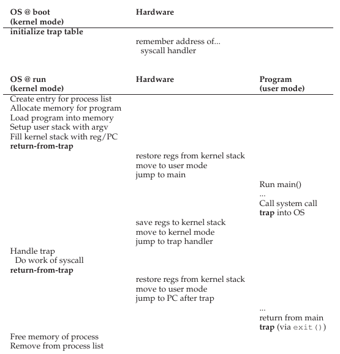

---
tags:
  - OSTEP
  - Processes
  - Scheduling
  - Limited Direct Execution
  - Chapter 6
  - Chapter 7
  - Chapter 8
---

# Limited Direct Execution

The OS must virtualize the CPU in an efficient manner while retaining control over the system.

### 6.1 Basic Technique: Limited Direct Execution
**Control:**

If the OS passed control to the program (Direct Execution), how could we make sure the program was not blocking the OS or acessing data that's not supposed to acess while still running effciently?

**Timesharing:**

The OS must timeshare the processes to keep the system responsive and allow the illusion of multi processing.

## 6.2 Problem #1: Restricited Operations

    

# Scheduling