---
tags:
  - OSTEP
  - Processes
  - Scheduling
  - Limited Direct Execution
  - Chapter 6
  - Chapter 7
  - Chapter 8
---

# Limited Direct Execution

The OS must virtualize the CPU in an efficient manner while retaining control over the system.

### 6.1 Basic Technique: Limited Direct Execution
**Control:**

If the OS passed control to the program (Direct Execution), how could we make sure the program was not blocking the OS or acessing data that's not supposed to acess while still running effciently?

**Timesharing:**

The OS must timeshare the processes to keep the system responsive and allow the illusion of multi processing.

## 6.2 Problem #1: Restricited Operations (Control)

To ensure that kernel mantains control over the program is executed in **user mode** and when in this mode can't perform I/O operations and acess memory locations outside it's region.

Although the kernel wants to restrict acess to certain files and memory addresses, the program still needs to perform I/O requests and/or allocate more memory.

To execute restricted operations we need to be in **kernel mode**. When the program wishes to perform some kind of privileged operation resort to **system calls**. 

To be able to perform system calls efficently the OS sets up a trap table(similar to an interrupt table) at boot time.

When program calls a system call, executes a trap instruction assigning a system-call number to a specific register or stack location and saving the registers to kernel stack. This way the kernel is always responsible for the code that's executed when a system call is performed.

    

## 6.3 Problem #2: Switching Between Processes (Timesharing)

### A Cooperatve Approach: Wait For System Calls

OS trusts the processes of the system to behave reasonably and call yield() sysCall that transfers control to the OS.

Problem -> If the program ends up in a infinite loop (because of a bug or exploit), the system needs reboot

### A Non-Cooperative Apporach: The OS Takes Control

Solution: A timer interrupt that when the interrupt is raised, the currently running process is halted and the OS regains control.

Similarly to when a system call(trap into OS) is executed, the hardware has the responsibility to save the program state when a interrupt occurs. 

### Saving and Restoring Context

Now that the OS has regained control, a decision has to be made: 
* Continue running the currently running process 
* Switch to a different one

This is called **context switch**.

When a context switch occurs some low level assembly code is executed in order to rapidly save the general purprose registers, PC and kernel stack pointer of the running process and then the same registers of the other process are restored. After restoring the information of the now running process, the OS returns from trap instruction and the context switch is complete.

    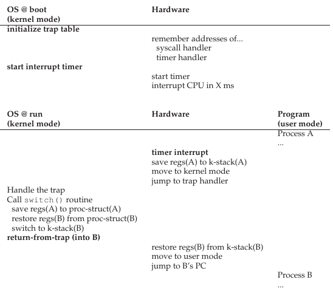

# Scheduling

when there are more than one process ready for executing which one should execute? 

The **scheduler** determines which process the CPU should be assigned.

## 7.1 Workload Assumptions

Making the following unrealistic assumptions about the processes:
1. Each job runs for the same amount of time.
2. All jobs arrive at the same time.
3. Once started, each job runs to completion.
4. All jobs only use the CPU (i.e., they perform no I/O).
5. The run-time of each job is known.

## 7.2 Scheduling Metrics

There are a lot of metrics for scheduling but assuming the metric is **turnaround time**. This metric is a performance metric and is defined by:

    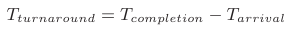

## 7.3 FIFO (non-preemptive)

First job to arrive is first served

**Problem:**
If we relax assumption **1** (Each job runs for the same amount of time) the average turnaround for the system is high (convoy effect) because if a long job is performed first the others need to wait for it to end before they run.

    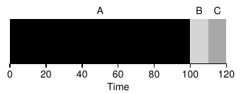

## 7.4 Shortest Job First (SJF) (non-preemptive)

The shortest job is first served. Optimal scheduling algorithm if all jobs arrive at the same time

**Problem:**
If we relax assumption **2** (All jobs arrive at the same time), a long job can arrive first and run till the end, making short jobs wait a lot. 

    

## 7.5 Shortest Time-to-Completion First (STCF) (preemptive)

To get better results we need to relax assumption **3** (Once started, each job runs to completion). Doing this the scheduler can preempt the long job and decide to run another job.

Making assumption **4** and **5**, this algorithm is optimal. 

    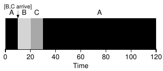

**Problem:**
The metric used is not the best!

## 7.6 A New Metric: Response Time

Because of the demand of interactive perform a new metric was born: **Response Time**

    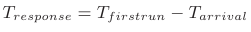

The scheduling algorithms presented are bad using response time has metric.

## 7.7 Round Robin

Runs a job for a time slice and then switches to the next job in the run queue. 

    

The lenght of the time slice must be a multiple of the timer interrupt period.

Smaller time slice -> Better response time

**Problems:**

1. If the time slice is too short the cost of context switching will dominate overall performance. There's a tradeoff between response time and performance. 
    * The cost of context switching arises from the **saving and restoring the registers**, **CPU caches**, TLB (memory address-> physical address), branch predictors and other on-chip hardware.
2. Awful turnaround time
    * Tradeoff between **fairness** and **performance**!

## 7.8 Incorporating I/O

Relaxing assumption **4** (All jobs only use the CPU (i.e., they perform no I/O) ) because all programs produce I/O. When a program performs I/O it won't be using the CPU, making it blocked waiting for I/O completion.

To get better performance the scheduler needs to assign another job to the CPU while the program is performing I/O. An interrupt is raised when the I/O is completed and moves the process from the waiting state to the ready state.

    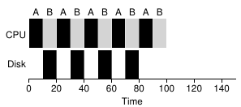

## 7.9 No More Oracle 

We are left with the final assumption **5** (The run-time of each job is known). 

**This one is the most unrealistic!** 

So we need a scheduler algorithm that has a decent turnaround time and response time (Shortest Time-to-Completion First + Round Robin) so we have good performance but also a fair algorithm.

## **Multi-Level Feedback Queue**

The MLFQ tries to optimize turnaround time while making the system responsive. To achieve this needs to learn as the system runs because generally the system knows nothing about the process.

## 8.1 MLFQ: Basic Rules

The MLFQ has a number of distinct queues with different prioritie and 2 basic rules:
1. If Priority(A) > Priority(B), A runs (B doesn’t).
2. If Priority(A) = Priority(B), A & B run in RR.

MLFQ varies the priority of a job based on its behavior:
* If a process continuously waits for input, keeps high priority.
* If a process uses the CPU intensively for long periods of time, it will reduce its priority.

    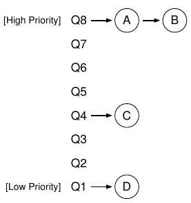

## 8.2 Attempt #1: How To Change Priority

Like RR, MLFQ uses time slices to swap between processes and changes the priority of a job based on that.

Introducing the following rules:

3. When a job enters the system, it is placed at the highest priority (the topmost queue).
4. 
    * a) If a job uses up an entire time slice while running, its priority is reduced (i.e., it moves down one queue).
    * b) If a job gives up the CPU before the time slice is up, it stays at the same priority level.

**Examples:** 

Long job + short job:

    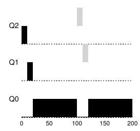

Interactive process:

    

**Problems:**
* **Starvation:** 

If there are **too many interactive** jobs the system will alternate between them because they will wait for I/O and the long running jobs will never receive any CPU time (**starve**).

    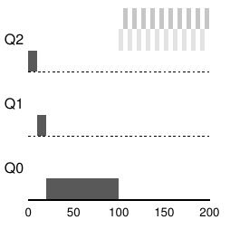

* **Game the scheduler (Gaming):** 

A smart user could issue fast I/O before the time slice is over in order to remain at top priority getting more CPU share and monopolizing the CPU.

    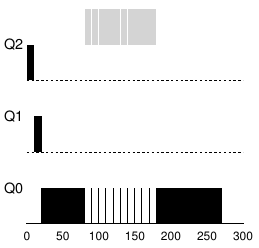

* **Change in behaviour:**

A CPU-Bound program can transition into an interactive program. In our current implementation the process would be out luck once it's on the lowest priority.

## 8.3 Attempt #2: The Priority Boost

To avoid starvation and account for a change in behaviour, we can periodically boost the priority of all jobs. 
Introducing a new rule:

5. After some time period S, move all the jobs in the system to the topmost queue.

    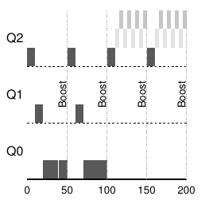

## 8.4 Attempt #3: Better Accounting

The problem with gambling occurs because the way we wrote rule 4. The OS should keep track of how much of a time slice the process used and reduce its priority once the time slice. This way the I/O time is irrelevant and only the ammount used by the process matters.

4. Once a job uses up its time allotment at a given level (regardless of how many times it has given up the CPU), its priority is reduced (i.e., it moves down one queue).

    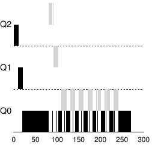

## 8.5 Tuning MLFQ and Other Issues

Some notes:

* The number of queues, time slice per queue, how often is the priority boosted are determined experimentally and are parameterized into the scheduler by constants(some OS allow easy configuration)

* Variable time slice across different queues

    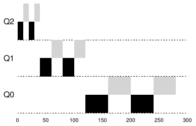

* Other OS use mathematical formulas to determine the priority instead of a table

* Some schedulers reserve the highest priority levels for OS work

## 8.6 MLFQ: Summary

### **Rules:**
1. If Priority(A) > Priority(B), A runs (B doesn’t).
2. If Priority(A) = Priority(B), A & B run in round-robin fashion using the time slice (quantum length) of the given queue.
3. When a job enters the system, it is placed at the highest priority (the topmost queue).
4. Once a job uses up its time allotment at a given level (regardless of how many times it has given up the CPU), its priority is reduced (i.e., it moves down one queue).
5. After some time period S, move all the jobs in the system to the topmost queue.
